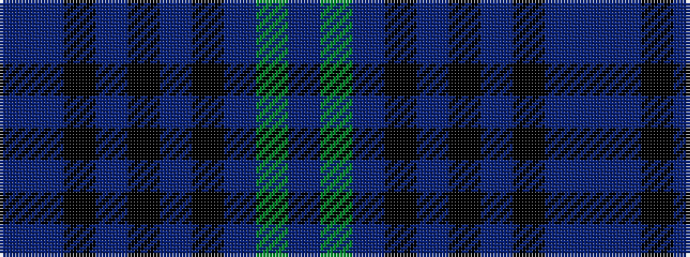

BBKBKBKBGB

It is a 10 stripe tartan.

<figure class="pat-woven">

<figcaption>idealised sample</figcaption>
</figure>

## Colour Sequence



## Tartans with this colour sequence

| Tartans |
|---------------|
| [Highland Granite](/variants/s10/do8y2do27k10n4k2n3k2n16do2~x2/)|
||
