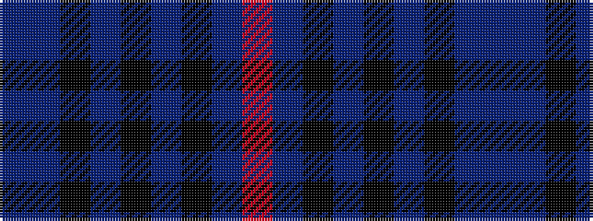

BBKBKBKBR

It is a 9 stripe tartan.

<figure class="pat-woven">

<figcaption>idealised sample</figcaption>
</figure>

## Colour Sequence



## Tartans with this colour sequence

| Tartans |
|---------------|
| [VersaCold/Atlas (Corporate)](/setts/s9/db3n44k9n10k9n10k9n44r3~x2/)|
||
