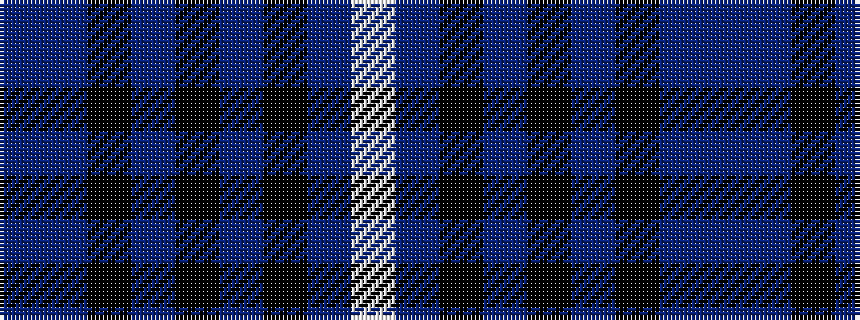

BBKBKBKBW

It is a 9 stripe tartan.

<figure class="pat-woven">

<figcaption>idealised sample</figcaption>
</figure>

## Colour Sequence



## Tartans with this colour sequence

| Tartans |
|---------------|
| [Royal College of Surgeons of Edinburgh](/variants/s9/t4dt16k2dt2k2dt2k13n20w4~x2/)|
||
