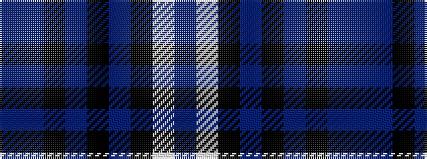

BBKBKBKWB

It is a 9 stripe tartan.

<figure class="pat-woven">

<figcaption>idealised sample</figcaption>
</figure>

## Colour Sequence



## Tartans with this colour sequence

| Tartans |
|---------------|
| [Chinzei Keiai Junior High School](/setts/s9/n3lp3k16n2k2n16k3n2n2~x2/)|
||
