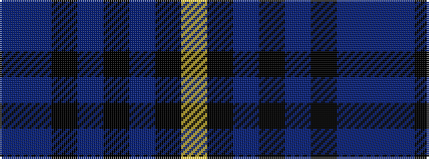

BBKBKBKY

It is a 8 stripe tartan.

<figure class="pat-woven">

<figcaption>idealised sample</figcaption>
</figure>

## Colour Sequence



## Tartans with this colour sequence

| Tartans |
|---------------|
| [Marine Harvest (Scotland)](/setts/s8/db10t2k2db1k6t1k45lo2~x2/)|
||
