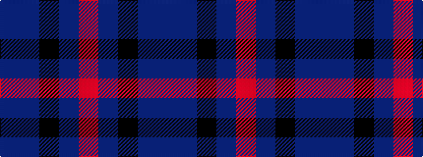

BBKBR

It is a 5 stripe tartan.

<figure class="pat-woven">

<figcaption>idealised sample</figcaption>
</figure>

## Colour Sequence



## Tartans with this colour sequence

| Tartans |
|---------------|
| [Deighan (Burham Kent) (Name)](/variants/s5/n4db43k20n7o2~x2/)|
||
| [Waugh (Name)](/variants/s5/db100t10k5t10r8/)|
||
