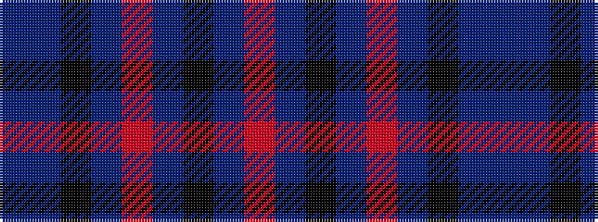

BBKBRBKBR

It is a 9 stripe tartan.

<figure class="pat-woven">

<figcaption>idealised sample</figcaption>
</figure>

## Colour Sequence



## Tartans with this colour sequence

| Tartans |
|---------------|
| [Chinzei Keiai Junior High School](/variants/s9/n3dp3k16n2o2n16k3n2o2~x2/)|
||
