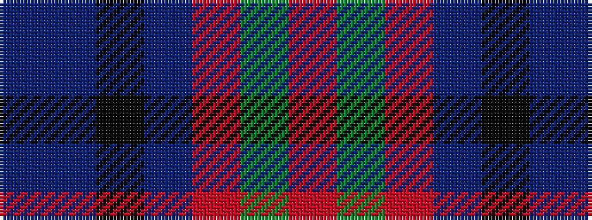

BBKBRGR

It is a 7 stripe tartan.

<figure class="pat-woven">

<figcaption>idealised sample</figcaption>
</figure>

## Colour Sequence



## Tartans with this colour sequence

| Tartans |
|---------------|
| [New York City](/variants/s7/b2db3k1db3o3g4r1~x8/)|
||
