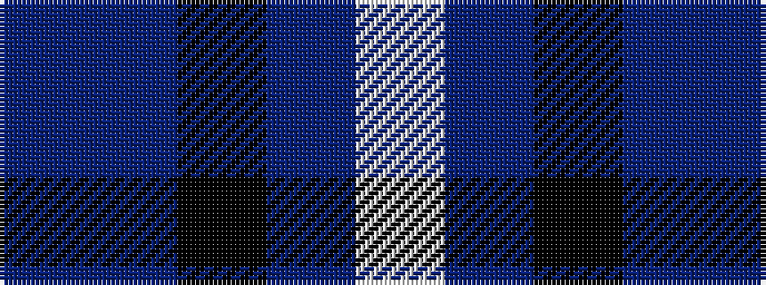

BBKBW

It is a 5 stripe tartan.

<figure class="pat-woven">

<figcaption>idealised sample</figcaption>
</figure>

## Colour Sequence



## Tartans with this colour sequence

| Tartans |
|---------------|
| [National Ballet of Canada](/setts/s5/do40n19k2n2lb2~x4/)|
||
