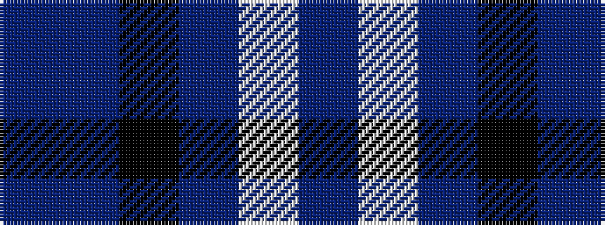

BBKBWB

It is a 6 stripe tartan.

<figure class="pat-woven">

<figcaption>idealised sample</figcaption>
</figure>

## Colour Sequence



## Tartans with this colour sequence

| Tartans |
|---------------|
| [MacFarland-Collins (Name)](/setts/s6/db40b16k5b16w2dp6~x2/)|
||
| [McFarland-Collins](/setts/s6/db40n16k5dt16w2dp6~x2/)|
||
