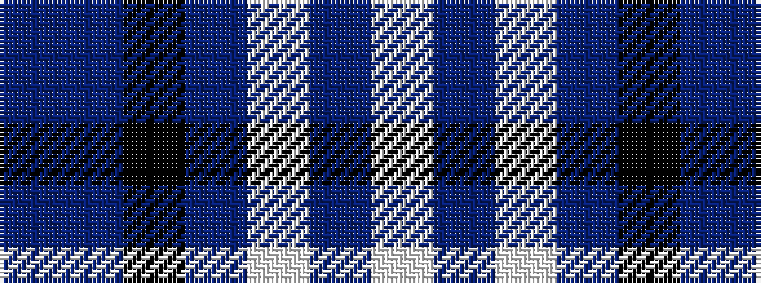

BBKBWBW

It is a 7 stripe tartan.

<figure class="pat-woven">

<figcaption>idealised sample</figcaption>
</figure>

## Colour Sequence



## Tartans with this colour sequence

| Tartans |
|---------------|
| [Cunningham Dress Purple (Dance)](/setts/s7/w5dp2w34dp34k2dp2t4~x2/)|
||
| [Cunningham Dress Purple (Dance) Fashion Tartan Tartan Number: 6531. Earliest known date: 01/01/1986 A dancers' tartan from D C Dalgliesh of Selkirk. See products available Copyright © Blair Urquhart, Comrie, 2015](/setts/s7/t2dp1k1dp20w20dp1w2~x4/)|
||
| [Cunningham, Dress Blue (Dance)](/setts/s7/b3db2k2db28w30db2w3~x2/)|
||
| [Cunningham, Dress Blue (Dance) Fashion Tartan Tartan Number: 4642. Earliest known date: 01/01/2002 Like so many of the invented 'Dance' tartans this one is not known by the relevant Clan Cunningham Association (USA). /Threadcount and colours aren't 100% original. Generated manually./ See products available Copyright © Blair Urquhart, Comrie, 2015](/setts/s7/t2db1k1db20w20db1w2~x4/)|
||
