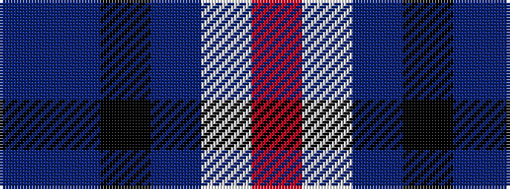

BBKBWR

It is a 6 stripe tartan.

<figure class="pat-woven">

<figcaption>idealised sample</figcaption>
</figure>

## Colour Sequence



## Tartans with this colour sequence

| Tartans |
|---------------|
| [Gandy of Myrton (Name)](/setts/s6/r14w5dt20k10t10dt10~x2/)|
||
