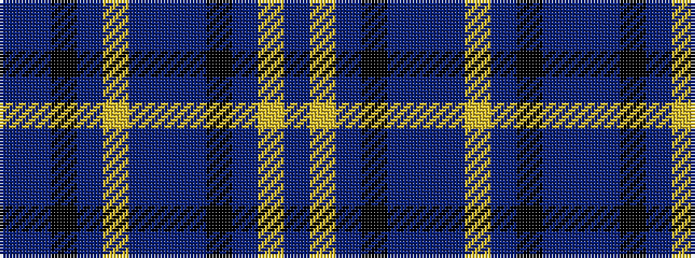

BBKBYBBBKBYB

It is a 12 stripe tartan.

<figure class="pat-woven">

<figcaption>idealised sample</figcaption>
</figure>

## Colour Sequence



## Tartans with this colour sequence

| Tartans |
|---------------|
| [Scottish Womens Rural Institute (Cor](/variants/s12/db10lo9db11k1db3t1~x4/)|
||
