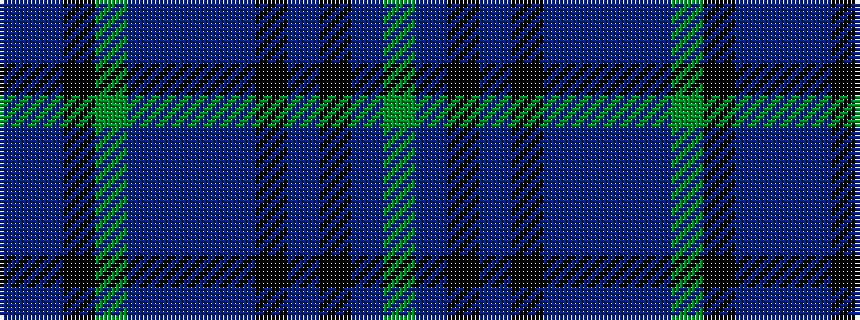

BBKGBBBBKBKBG

It is a 13 stripe tartan.

<figure class="pat-woven">

<figcaption>idealised sample</figcaption>
</figure>

## Colour Sequence



## Tartans with this colour sequence

| Tartans |
|---------------|
| [Scotland 1782 (Fashion)](/setts/s13/g3dp2k4dp2k2dp10dpi2dp2dpi2g3k4db30t3~x2/)|
||
