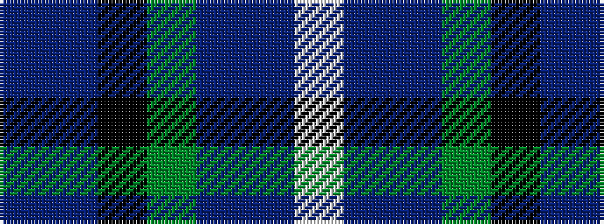

BBKGBBW

It is a 7 stripe tartan.

<figure class="pat-woven">

<figcaption>idealised sample</figcaption>
</figure>

## Colour Sequence



## Tartans with this colour sequence

| Tartans |
|---------------|
| [Barrance, Paul and Kelly (Personal)](/setts/s7/dp3dt42k2dg17dt9dp3w2~x2/)|
||
