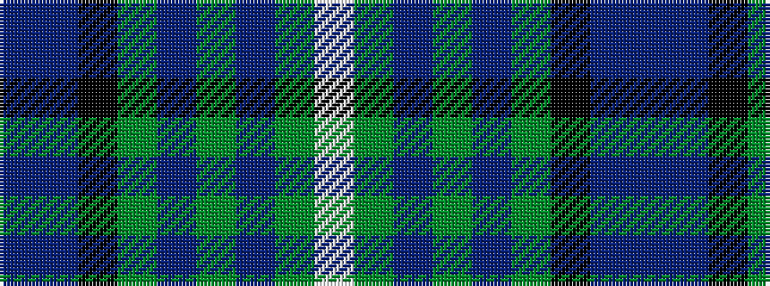

BBKGBGBGW

It is a 9 stripe tartan.

<figure class="pat-woven">

<figcaption>idealised sample</figcaption>
</figure>

## Colour Sequence



## Tartans with this colour sequence

| Tartans |
|---------------|
| [Ebdon-Muir (Personal)](/variants/s9/dp4db40k15g10dp2g10dp2g10w4~x2/)|
||
