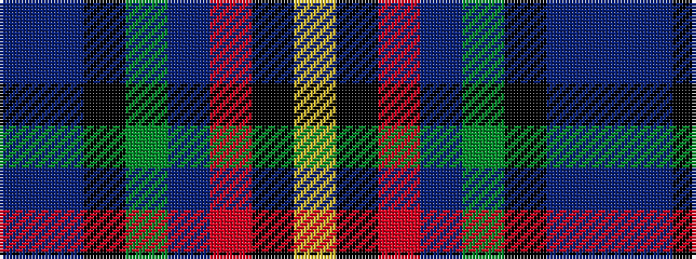

BBKGBRKY

It is a 8 stripe tartan.

<figure class="pat-woven">

<figcaption>idealised sample</figcaption>
</figure>

## Colour Sequence



## Tartans with this colour sequence

| Tartans |
|---------------|
| [Law Enforcement Officers' Memorial](/setts/s8/db6db4k37g6db80o4k4lo4/)|
||
