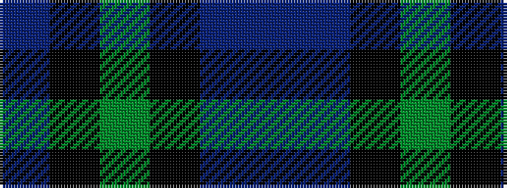

BBKGKB

It is a 6 stripe tartan.

<figure class="pat-woven">

<figcaption>idealised sample</figcaption>
</figure>

## Colour Sequence



## Tartans with this colour sequence

| Tartans |
|---------------|
| [Murray](/setts/s6/t3k16dg16k16db3t3~x2/)|
||
| [Murray](/setts/s6/t3k16g16k16db3t3~x2/)|
||
| [Unidentified No 59](/setts/s6/t1db11k11dg11k2t1~x2/)|
||
| [Unnamed, No 59](/setts/s6/t1db11k11g11k2t1~x2/)|
||
| [Wilson's No.228 #2](/setts/s6/dp8k11dg9k11dp8t2~x2/)|
||
