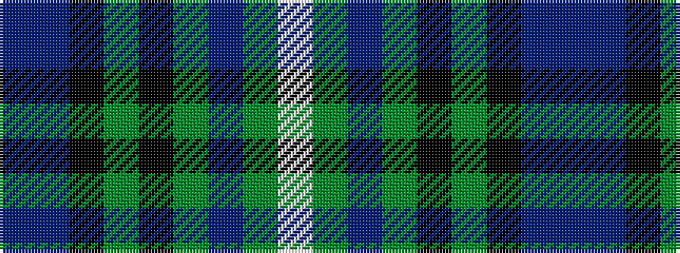

BBKGKGBGW

It is a 9 stripe tartan.

<figure class="pat-woven">

<figcaption>idealised sample</figcaption>
</figure>

## Colour Sequence



## Tartans with this colour sequence

| Tartans |
|---------------|
| [Faskin Family (Aberdeenshire)](/variants/s9/t1dp10k10g12k1g12t2g16w1~x2/)|
||
