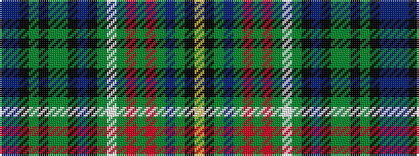

BBKGKGGKBKGWGRGRGBGKY

It is a 21 stripe tartan.

<figure class="pat-woven">

<figcaption>idealised sample</figcaption>
</figure>

## Colour Sequence



## Tartans with this colour sequence

| Tartans |
|---------------|
| [Unidentified #3](/setts/s21/dp128db20k3dg6k1dg4dg8k2b5k2dg70w6dg12r24dg5r5dg8db4dg12k2ly7/)|
||
| [Unidentified 5](/setts/s21/p128db20k3dg6k1dg4g8k2b5k2g70w6g12r24g5r5g8db4g12k2ly7/)|
||
