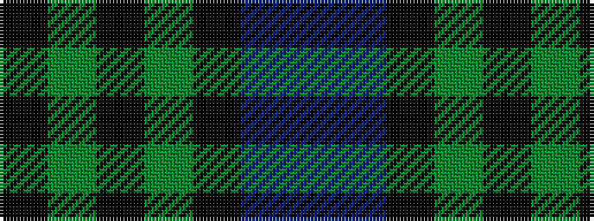

BBKGKGK

It is a 7 stripe tartan.

<figure class="pat-woven">

<figcaption>idealised sample</figcaption>
</figure>

## Colour Sequence



## Tartans with this colour sequence

| Tartans |
|---------------|
| [MacIntyre](/setts/s7/k12dg12k2dg12k12db12t3~x2/)|
||
| [MacIntyre](/setts/s7/k12g12k2g12k12db12t3~x2/)|
||
