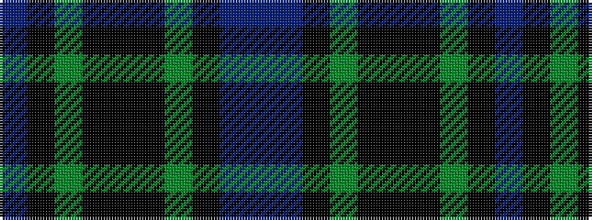

BBKGKKKGKB

It is a 10 stripe tartan.

<figure class="pat-woven">

<figcaption>idealised sample</figcaption>
</figure>

## Colour Sequence



## Tartans with this colour sequence

| Tartans |
|---------------|
| [Smith (Sir William)](/variants/s10/db18ki20g20ki1k3ki1g20ki20db18t3~x2/)|
||
