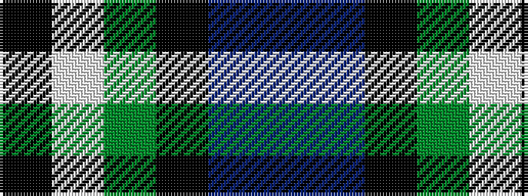

BBKGWK

It is a 6 stripe tartan.

<figure class="pat-woven">

<figcaption>idealised sample</figcaption>
</figure>

## Colour Sequence



## Tartans with this colour sequence

| Tartans |
|---------------|
| [New York, Firemen's Pipe Band](/setts/s6/k14w3g42k36db40t10/)|
||
