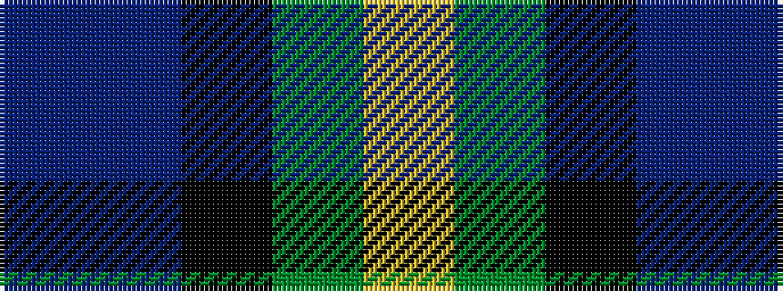

BBKGY

It is a 5 stripe tartan.

<figure class="pat-woven">

<figcaption>idealised sample</figcaption>
</figure>

## Colour Sequence



## Tartans with this colour sequence

| Tartans |
|---------------|
| [Nobiliary Fraternity](/variants/s5/dp11t2k10g10ly3~x2/)|
||
| [Selkirk (Personal)](/variants/s5/dp27db4k27g27lo4~x2/)|
||
| [Wilson's, No 217](/variants/s5/p11t2k10g10ly2~x2/)|
||
