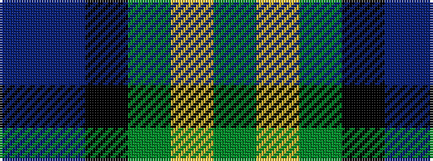

BBKGYG

It is a 6 stripe tartan.

<figure class="pat-woven">

<figcaption>idealised sample</figcaption>
</figure>

## Colour Sequence



## Tartans with this colour sequence

| Tartans |
|---------------|
| [Lanark](/setts/s6/dg31ly4dg6k19db18t9~x2/)|
||
| [Lanarkshire](/setts/s6/g31ly4g6k19db18t9~x2/)|
||
