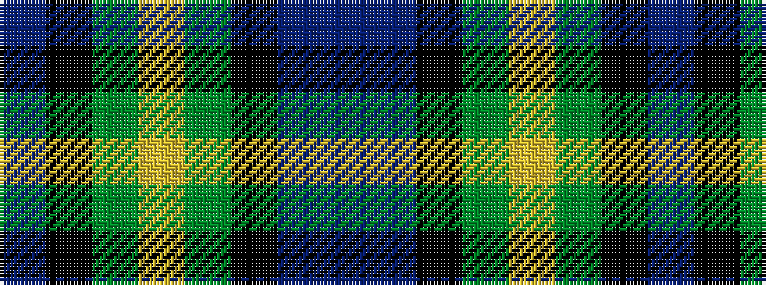

BBKGYGKB

It is a 8 stripe tartan.

<figure class="pat-woven">

<figcaption>idealised sample</figcaption>
</figure>

## Colour Sequence



## Tartans with this colour sequence

| Tartans |
|---------------|
| [Wilson's No.217](/variants/s8/dp11t2k10g10ly3~x2/)|
||
