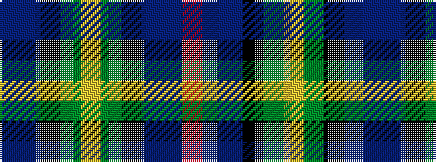

BBKGYGKBBR

It is a 10 stripe tartan.

<figure class="pat-woven">

<figcaption>idealised sample</figcaption>
</figure>

## Colour Sequence



## Tartans with this colour sequence

| Tartans |
|---------------|
| [Huntly Gordon 2000](/variants/s10/dt3b12k11g11ly2g11k11b12dt3r2~x2/)|
||
