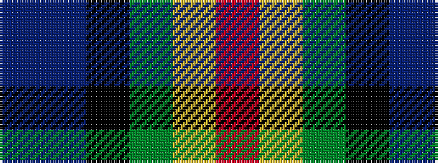

BBKGYR

It is a 6 stripe tartan.

<figure class="pat-woven">

<figcaption>idealised sample</figcaption>
</figure>

## Colour Sequence



## Tartans with this colour sequence

| Tartans |
|---------------|
| [Josse (Bro Sant Malo), Gilbert (Personal)](/variants/s6/db1t2k50g50ly2r1~x2/)|
||
