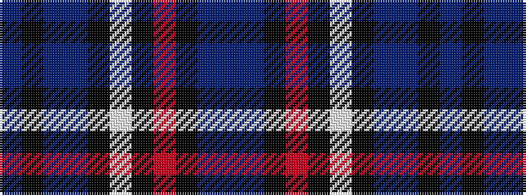

BBKRKWKBBKB

It is a 11 stripe tartan.

<figure class="pat-woven">

<figcaption>idealised sample</figcaption>
</figure>

## Colour Sequence



## Tartans with this colour sequence

| Tartans |
|---------------|
| [Glen Clova #1](/setts/s11/n19do2k3o1k1w1k1do6n3k1n6~x4/)|
||
