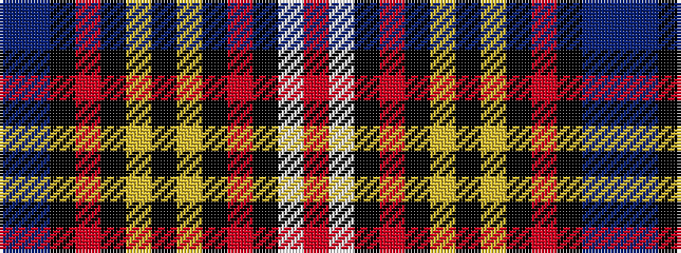

BBKRKYKYKRKWR

It is a 13 stripe tartan.

<figure class="pat-woven">

<figcaption>idealised sample</figcaption>
</figure>

## Colour Sequence



## Tartans with this colour sequence

| Tartans |
|---------------|
| [Buchanan Dress (Fashion)](/variants/s13/r3w34k2o4k2lo7k2lo7k2o4k2do34t3~x2/)|
||
