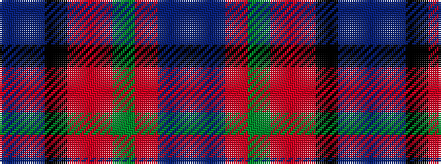

BBKRRGRBB

It is a 9 stripe tartan.

<figure class="pat-woven">

<figcaption>idealised sample</figcaption>
</figure>

## Colour Sequence



## Tartans with this colour sequence

| Tartans |
|---------------|
| [Moray of Abercairney](/setts/s9/db3t1k1ri12r1g9ri1t1db3~x4/)|
||
| [Moray of Abercairney Clan Tartan Tartan Number: 51. Earliest known date: 1735 The sett is derived from the portrait of James, 14th Laird, painted about 1735. Historians have made different interpretations of the tartan. The tartan is similar to other Perthshire setts but not to the Clan Murray tartan. See products available Copyright © Blair Urquhart, Comrie, 2015](/setts/s9/db3t1k1r12ri1g9r1t1db3~x4/)|
||
