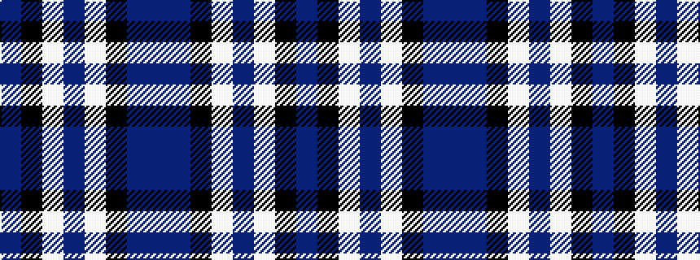

BBKWBWKB

It is a 8 stripe tartan.

<figure class="pat-woven">

<figcaption>idealised sample</figcaption>
</figure>

## Colour Sequence



## Tartans with this colour sequence

| Tartans |
|---------------|
| [Auto Docs](/setts/s8/db30dbi2k9w3db6w4k3dbi6~x2/)|
||
