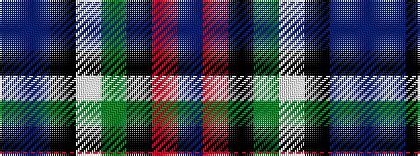

BBKWGKRB

It is a 8 stripe tartan.

<figure class="pat-woven">

<figcaption>idealised sample</figcaption>
</figure>

## Colour Sequence



## Tartans with this colour sequence

| Tartans |
|---------------|
| [Moran (Coilessan) (Personal)](/variants/s8/t26db13k13w2g8k5r3t3~x2/)|
||
