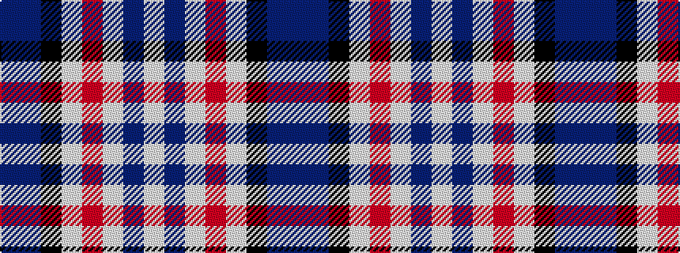

BBKWRWBW

It is a 8 stripe tartan.

<figure class="pat-woven">

<figcaption>idealised sample</figcaption>
</figure>

## Colour Sequence



## Tartans with this colour sequence

| Tartans |
|---------------|
| [Silver Wedding (Fashion)](/variants/s8/dp8n44k32lp2o53lb8n8lb4/)|
||
