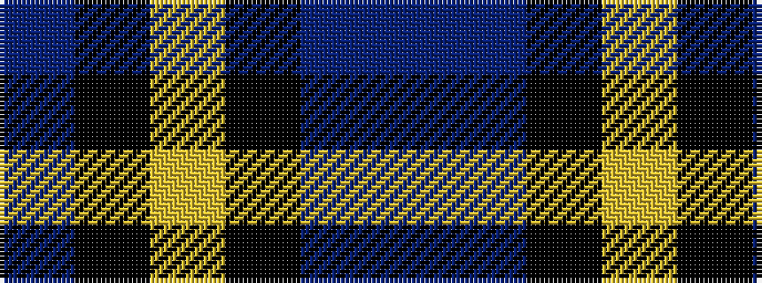

BBKYKB

It is a 6 stripe tartan.

<figure class="pat-woven">

<figcaption>idealised sample</figcaption>
</figure>

## Colour Sequence



## Tartans with this colour sequence

| Tartans |
|---------------|
| [Martinez, Clément (Personal)](/setts/s6/dt22k16ly4k11dp2n1~x4/)|
||
