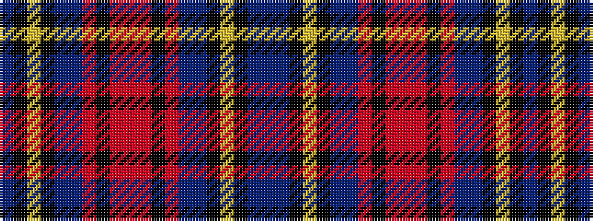

BBKYKBBRKRRRKRBBKYKB

It is a 20 stripe tartan.

<figure class="pat-woven">

<figcaption>idealised sample</figcaption>
</figure>

## Colour Sequence



## Tartans with this colour sequence

| Tartans |
|---------------|
| [Kirk in the Hills Corporate Tartan](/variants/s20/t32db12k2ly2k2db2t8ri63k2r2ri9~x2/)|
||
