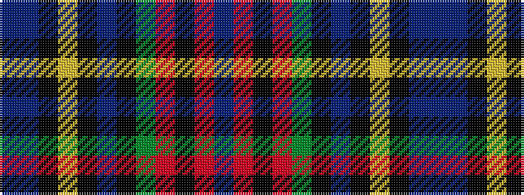

BBKYKBKGRKRB

It is a 12 stripe tartan.

<figure class="pat-woven">

<figcaption>idealised sample</figcaption>
</figure>

## Colour Sequence



## Tartans with this colour sequence

| Tartans |
|---------------|
| [Royal Stewart, (Variant)](/setts/s12/t57db4k8ly4k4t4k4g8r6k4r4t2/)|
||
| [Stewart Blue](/setts/s12/t29db3k10ly2k2t2k2g10r5k3r2t2~x2/)|
||
| [Stuart/Stewart Blue](/setts/s12/t29db3k10lo2k2t2k2g10r5k3r2t2~x2/)|
||
| [Stuart/Stewart Royal variant](/setts/s12/t57db4k8ly4k4t4k4dg8r6k4r4t2/)|
||
