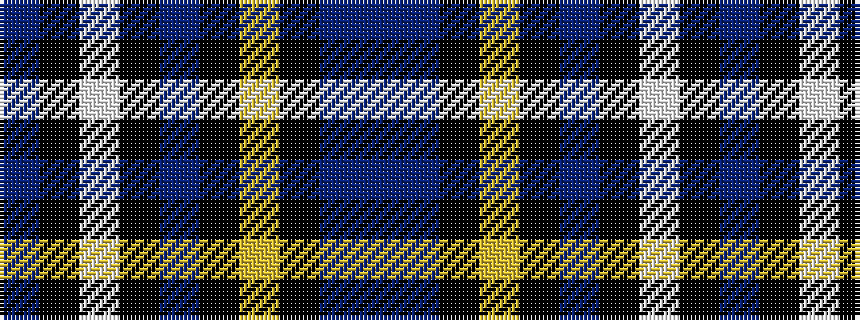

BBKYKBKWKB

It is a 10 stripe tartan.

<figure class="pat-woven">

<figcaption>idealised sample</figcaption>
</figure>

## Colour Sequence



## Tartans with this colour sequence

| Tartans |
|---------------|
| [Canberra, City of](/variants/s10/n76t22k1ly3k1t3k1w2k1t10~x2/)|
||
