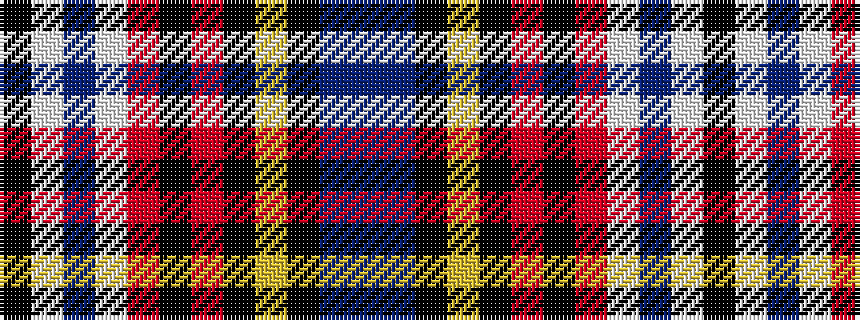

BBKYKRKRWBWK

It is a 12 stripe tartan.

<figure class="pat-woven">

<figcaption>idealised sample</figcaption>
</figure>

## Colour Sequence



## Tartans with this colour sequence

| Tartans |
|---------------|
| [MacLean of Duart Dress #5](/variants/s12/t12db2k4ly2k3m3k3m19w31db2w4k2~x2/)|
||
| [MacLean, dress Burgundy](/variants/s12/t12db2k4ly2k3r3k3r19w31db2w4k2~x2/)|
||
