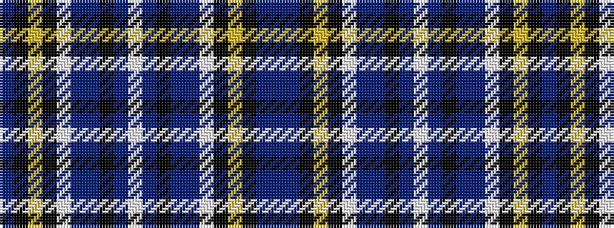

BBKYKWBBKBWBKBBWKYKB

It is a 20 stripe tartan.

<figure class="pat-woven">

<figcaption>idealised sample</figcaption>
</figure>

## Colour Sequence



## Tartans with this colour sequence

| Tartans |
|---------------|
| [Suffolk County Police](/setts/s20/db74db6k12ly3k3w3db16db8k3db4w3~x2/)|
||
