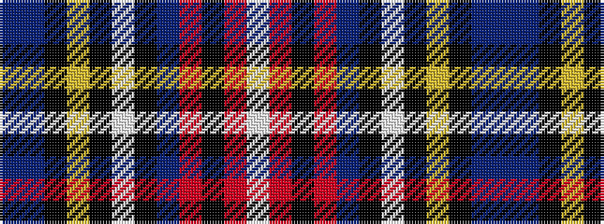

BBKYKWKBRKRW

It is a 12 stripe tartan.

<figure class="pat-woven">

<figcaption>idealised sample</figcaption>
</figure>

## Colour Sequence



## Tartans with this colour sequence

| Tartans |
|---------------|
| [British Caledonian Airways #2](/setts/s12/n68b5k9lo3k3lb3k3n20r9k3r5lb4/)|
||
| [Stuart/Stewart Black](/setts/s12/db20b6k8ly2k4w4k4db13r7k4r4w2~x2/)|
||
