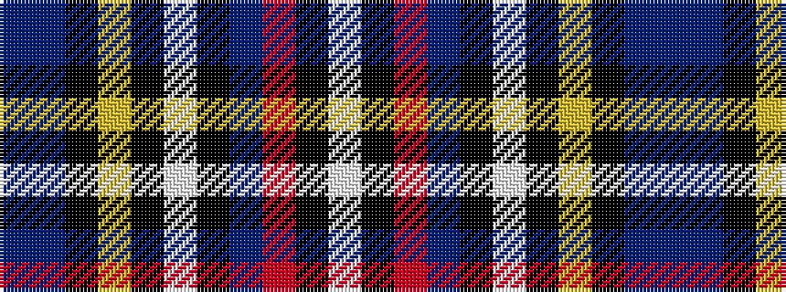

BBKYKWKBRKW

It is a 11 stripe tartan.

<figure class="pat-woven">

<figcaption>idealised sample</figcaption>
</figure>

## Colour Sequence



## Tartans with this colour sequence

| Tartans |
|---------------|
| [Stewart Black](/setts/s11/db20b6k8ly2k4w4k4db13r7k4w2~x2/)|
||
