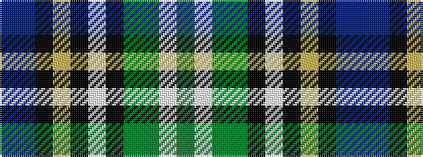

BBKYKWKGGWG

It is a 11 stripe tartan.

<figure class="pat-woven">

<figcaption>idealised sample</figcaption>
</figure>

## Colour Sequence



## Tartans with this colour sequence

| Tartans |
|---------------|
| [MacLean of Kingairloch Clan Tartan Tartan Number: 61. Earliest known date: pre 2003 Reproduction. See products available Copyright © Blair Urquhart, Comrie, 2015](/setts/s11/db8t1k6ly1k2w2k2g12dy28w1dy4~x2/)|
||
