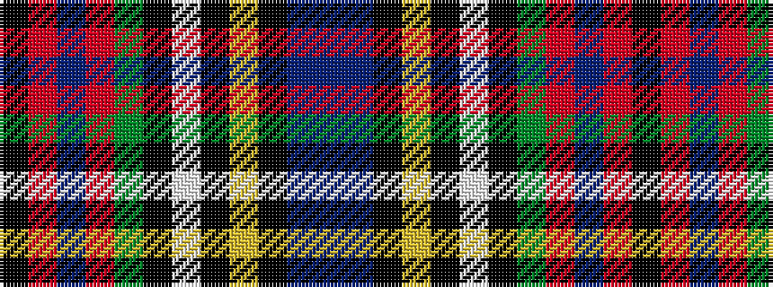

BBKYKWKGRBRK

It is a 12 stripe tartan.

<figure class="pat-woven">

<figcaption>idealised sample</figcaption>
</figure>

## Colour Sequence



## Tartans with this colour sequence

| Tartans |
|---------------|
| [MacLean](/variants/s12/do9t5k8ly2k4w4k4g28r44t4r5k3~x2/)|
||
| [MacLean (rare)](/variants/s12/do9t5k8ly2k4w4k4dg28r44t4r5k3~x2/)|
||
| [MacLean of Duart 5](/setts/db4t1k3ly1k1w1k1g8r12t1r2k1/)|
||
