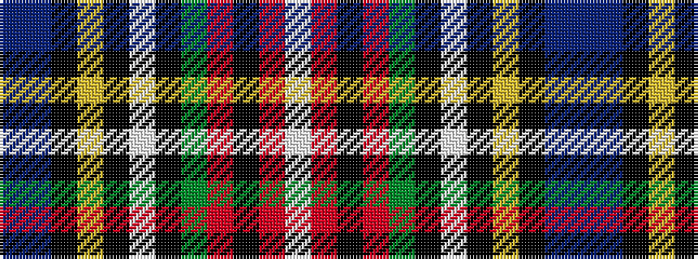

BBKYKWKGRKRW

It is a 12 stripe tartan.

<figure class="pat-woven">

<figcaption>idealised sample</figcaption>
</figure>

## Colour Sequence



## Tartans with this colour sequence

| Tartans |
|---------------|
| [Stewart Black](/variants/s12/db20t6k8ly2k4w4k4g13r7k4r3w2~x2/)|
||
| [Stuart/Stewart Black #3](/variants/s12/db20t6k8ly2k4w4k4dg13r7k4r3w2~x2/)|
||
