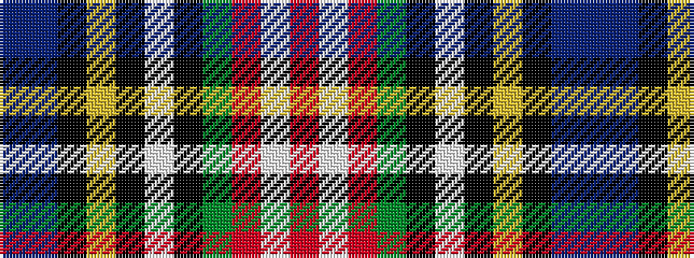

BBKYKWKGRWR

It is a 11 stripe tartan.

<figure class="pat-woven">

<figcaption>idealised sample</figcaption>
</figure>

## Colour Sequence



## Tartans with this colour sequence

| Tartans |
|---------------|
| [MacLean of Kingairloch](/setts/s11/db8t1k6ly1k2w2k2g12o28w1o4~x2/)|
||
