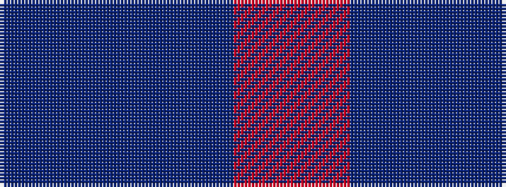

BBR

It is a 3 stripe tartan.

<figure class="pat-woven">

<figcaption>idealised sample</figcaption>
</figure>

## Colour Sequence



## Tartans with this colour sequence

| Tartans |
|---------------|
| [Glenmorangie Check Corporate Tartan Tartan Number: 1663. Earliest known date: 1988 Accredited by the Scottish Tartans Society in 1988. Glenmorangie is a well known malt whisky. See products available Copyright © Blair Urquhart, Comrie, 2015](/setts/s3/dr1dr2r1~x10/)|
||
| [Stakis Hotels (Corporate)](/setts/s3/t9db14r1~x4/)|
||
