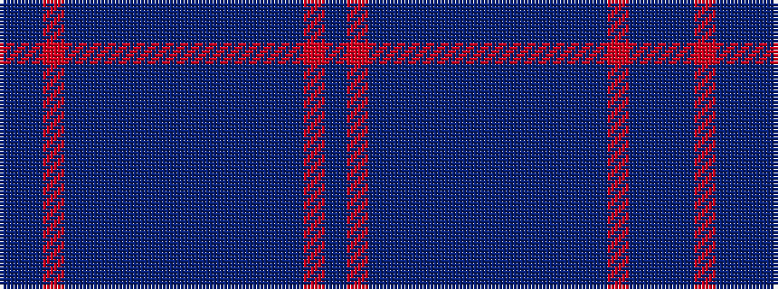

BBRBBBBBBBBBBBRB

It is a 16 stripe tartan.

<figure class="pat-woven">

<figcaption>idealised sample</figcaption>
</figure>

## Colour Sequence



## Tartans with this colour sequence

| Tartans |
|---------------|
| [Meanwood McMain Personal Tartan Tartan Number: 6813. Earliest known date: 2005 December This was a gift from her colleagues to Dr. McMain from the meanwood Group Practice in Leeds on the occasion of her relocation to Australia after 16 years in Leeds. Designed by Maxine Scott of the House of Tartan. See products available Copyright © Blair Urquhart, Comrie, 2015](/setts/s16/dp30db10m5db10dp30db3dp5db3dp30~x2/)|
||
