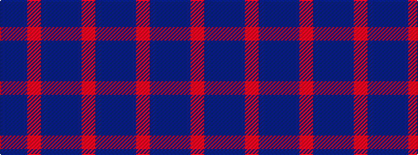

BBRBBBR

It is a 7 stripe tartan.

<figure class="pat-woven">

<figcaption>idealised sample</figcaption>
</figure>

## Colour Sequence



## Tartans with this colour sequence

| Tartans |
|---------------|
| [Redpath, Ronald (Personal)](/variants/s7/dp26dpi15r7t2ti7dt17r4~x2/)|
||
