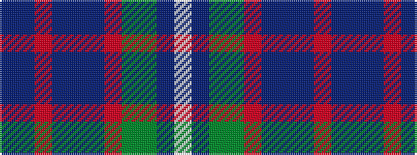

BBRBBBRGGBW

It is a 11 stripe tartan.

<figure class="pat-woven">

<figcaption>idealised sample</figcaption>
</figure>

## Colour Sequence



## Tartans with this colour sequence

| Tartans |
|---------------|
| [Scottish H & I Film Com (Corporate)](/setts/s11/n16db8o2n2db2n2r1y4dg4n4w2~x4/)|
||
